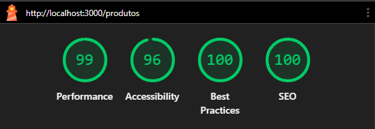

# Innovation Brindes -- Teste Frontend

Aplicação desenvolvida com **Next.js (App Router)**, **TypeScript**,
**TailwindCSS**, **Zustand**, **React Query** e **Axios (com
interceptors)**.

---

## 🚀 Como rodar a aplicação com Docker

### 1) Build da imagem

docker build -t innovation-brindes-app .

### 2) Rodar o container

docker run -p 3000:3000 -e
NEXT_PUBLIC_API_URL=https://apihomolog.innovationbrindes.com.br/api/innova-dinamica
innovation-brindes-app

A aplicação ficará disponível em:

http://localhost:3000

---

## 🛠 Stack utilizada

- Next.js (App Router)
- TypeScript
- TailwindCSS
- Zustand
- React Query
- Axios com interceptors
- Radix Dialog
- Middleware (proteção de rota)
- Docker
- Vitest + React Testing Library

---

## 🔐 Autenticação

- Login via POST /login/acessar
- Token salvo em localStorage (interceptor)
- Token salvo em cookie (middleware)
- Authorization: Bearer `<token>`{=html}
- Em caso de 401 → redireciona para /login

---

## 📦 Funcionalidades implementadas

- Login com "manter logado"
- Rota protegida com Middleware
- Listagem de produtos
- Busca com debounce (POST)
- Ordenação local (nome e preço)
- Infinite scroll por lotes
- Favoritos persistidos no localStorage
- Quick View acessível
- Skeleton + tratamento de erro
- SEO básico

---

## 🧪 Testes

Foi implementado 1 teste unitário com Vitest + React Testing Library.

Arquivo testado: src/features/products/ProductCard.test.tsx

Valida: - Renderização de nome e código - Clique no botão CONFIRA
chamando onQuickView

Rodar testes:

yarn test:run

Modo watch:

yarn test

---

## 🧠 Decisões Técnicas

### Middleware + Cookie

Middleware do Next não acessa localStorage, então o token também é salvo
em cookie.

### Infinite Scroll

Como a API não possui paginação, foi implementado carregamento por lotes
no client usando IntersectionObserver.

### Zustand

Utilizado para gerenciamento simples e performático de estado global.

### React Query

Gerenciamento de cache, loading e retry automático.

### Modal com Radix

Garantia de acessibilidade (focus trap e ESC).

---

## ⚠ Pendências / Melhorias Futuras

- Paginação real se API suportar
- Ampliar cobertura de testes
- Melhorar UX do infinite scroll
- Ajustes para atingir 100% no Lighthouse

---

## 📊 Lighthouse (Desktop)

---

## 🎥 Demonstração do Fluxo

Esse Issue do gif é erro de uma extensão que uso no navegador.

---

## 🧪 Rodando sem Docker

yarn yarn dev

Criar .env.local:

NEXT_PUBLIC_API_URL=https://apihomolog.innovationbrindes.com.br/api/innova-dinamica

---

## 📌 Considerações Finais

Projeto estruturado com foco em boas práticas modernas do ecossistema
React/Next.js, organização por domínio e qualidade de código.
